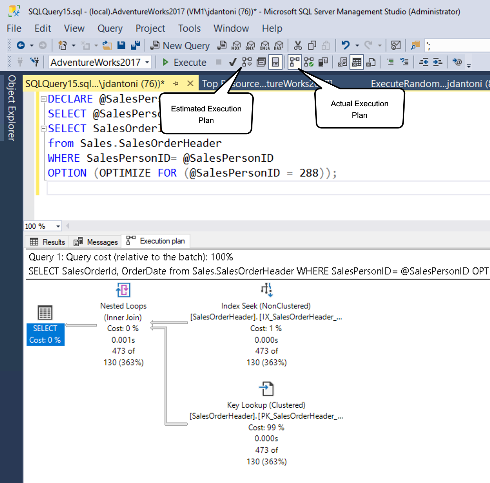
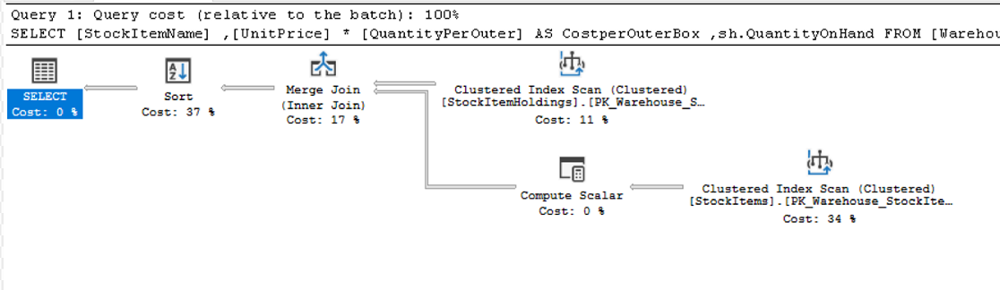

# Explore Query Performance
- Query Store helps you quickly identify your most expensive queries, and find any changes in performance.
- The Query Store provides a powerful data collection including the automation of query plan and execution runtime.


# Query Plans
- It's helpful to have a basic understanding of how database optimizers work before taking a deeper dive into execution plan details.
- The optimizer is responsible for determining the most efficient way to execute a query.
- SQL Server uses what is known as cost-based query optimizer.
- The query optimizer calculates a cost for multiple possible plans based on the statistics it has on the columns being utilized, and the possible indexes that can be used for each operation in each query plan.
- Some complex queries can have thousands of possible execution plans. 
- The optimizer doesn't evaluate every possible plan, but uses heuristics to determine plans that are likely to have good performance. 
- The optimizer will then choose the lowest cost plan of all the plans evaluated for a given query.

---

- The statistics SQL Server uses to track the distribution of data in columns and indexes need be kept up to date, or it can cause suboptimal execution plans to be generated.
- SQL Server automatically updates its statistics as data changes in a table; however, more frequent updates may be needed for rapidly changing data. 
- The engine uses many factors when building a plan including compatibility level of the database, row estimates based on statistics and available indexes.

---

When a user submits a query to the database engine, the following process happens:
1. The query is parsed for proper syntax and a parse tree of database objects is generated if the syntax is correct. 
2. The parse tree from Step 1 is taken as input to a database engine component called the Algebrizer for binding. This step validates that columns and objects in the query exist and identifies the data types that are being processed for a given query. This step outputs a query processor tree, which is in the input for step 3.
3. Because query optimization is a relatively expensive process in terms of CPU consumption, the database engine caches execution plans in a special area of memory called the plan cache. If a plan for a given query already exists, that plan is retrieved from the cache. The queries whose plans are stored in cache will each have a hash value generated based on the T-SQL in the query. This value is referred to as the query_hash. The engine will generate a query_hash for the current query and then look to see if it matches any existing queries in the plan cache.
4. If the plan doesn't exist, the Query Optimizer then uses its cost-based optimizer to generate several execution plan options based on the statistics about the columns, tables, and indexes that are used in the query, as described above. The output of this step is a query execution plan.
5. The query is then executed using an execution plan that is pulled from the plan cache, or a new plan generated in step 4. The output of this step is the results of your query.

Details: https://learn.microsoft.com/en-us/sql/relational-databases/query-processing-architecture-guide?view=sql-server-ver16

---

Query Plan capture estimations for query:
- **Number of rows.** The number of rows that will be returned by each operation in the plan.
- **Memory requirement.** The memory required to perform operations such as joining or sorting data.
  - The memory needed by the query is called the memory grant.
  - The memory grant is a good example of the importance of statistics. 
  - If SQL Server thinks an operator is going to return 10,000,000 rows, when it's only returning 100, a much larger amount of memory is granted to the query.
  - If the moemory grant that is larger than necessary, it can cause 2 problems:
    - First, the query may encounter a RESOURCE_SEMAPHORE wait, which indicates that query is waiting for SQL Server to allocate it a large amount of memory.
    - Second, when the query is executed, if there isn't enough memory available, the query will spill to tempdb, which is much slower than operating in memory.

---

The execution plan also stores other metadata about the query, such as:
- **Actual number of rows.** The number of rows that were actually returned by each operation in the plan.
- **Actual memory used.** The amount of memory that was actually used by the query.
- **Actual execution time.** The amount of time it took to execute the query.
- **Actual CPU time.** The amount of CPU time used by the query.
- .... and more.

---

Query plans can be viewed either in a graphical representation or in a text-based format. 
The text-based options are invoked with SET commands and apply only to the current connection. 
Text-based plans can be viewed anywhere you can run T-SQL queries.

There are several ways you can view and save graphical query plans. 
The most common tool used for this purpose is SQL Server Management Studio, but estimated plans can also be viewed in Azure Data Studio. 
There are also third-party tools that support viewing graphical execution plans.


## Query Plan Types

### Estimated Execution Plan
- The estimated execution plan is generated by the Query Optimizer before the query is executed.
- The metadata and size of query memory grant are based on estimates from the statistics as they exist in the database at the time of query compilation.
- `SET SHOWPLAN_ALL ON` or `SET SHOWPLAN_TEXT ON` can be used to view the estimated execution plan.
- When you run the query, you'll see the steps of the execution plan, but the query **will NOT** be executed, and you won't see any results. 
- The SET option will stay in effect until you set it OFF.
- **Control + L** can be used to toggle the estimated execution plan in SQL Server Management Studio.


### Actual Execution Plan
- The actual execution plan is generated by the Query Optimizer after the query is executed.
- This type is same plan as the estimated plan; however this plan also contains the execution context for the query, which includes the estimated and actual row counts, any execution warnings, the actual degree of parallelism (number of processors used) and elapsed and CPU times used during the execution.
- `SET STATISTICS PROFILE ON` can be used to view the actual execution plan.
- The query will execute, and you get the plan and the results.
- The SET option will stay in effect until you set it OFF.
- **Control + M** can be used to toggle the actual execution plan in SQL Server Management Studio. 


### Live Query Statistics
- This plan viewing option combines the estimated and actual plans into an animated plan that displays execution progress through the operators in the plan.
- This feature is available in SQL Server Management Studio 17.4 and later.
- The Live Query Statistics feature can be enabled by clicking the "Include Live Query Statistics" button in the toolbar.


### Estimated vs Actual
- The difference is that the actual plan includes runtime statistics that aren't captured in the estimated plan.
- For example, the query may be an UPDATE statement that can only be run once. However, if you need to see query results and the plan, you’ll need to use one of the actual plan options.
- The estimated plan is useful for understanding how the optimizer is interpreting your query and how it plans to execute it.




Usually you can use the estimated execution plan while writing your query, to understand its performance characteristics, identify missing indexes, or detect query anomalies.


## Read Query Plan
```tsql
SELECT [stockItemName]
 ,[UnitPrice] * [QuantityPerOuter] AS CostPerOuterBox
 ,[QuantityonHand]

FROM [Warehouse].[StockItems] s
 JOIN [Warehouse].[StockItemHoldings] sh ON s.StockItemID = sh.StockItemID
ORDER BY CostPerOuterBox;
```



- Each icon in the plan shows a specific operation, which represents the various actions and decisions that make up an execution plan. 
- The SQL Server database engine has over 100 query operators that can make up on an execution plan.
- You'll notice that under each operator icon, there's a cost percentage relative to the total cost of the query.
- Even an operation that shows a cost of 0% still represents some cost. In fact, 0% is usually due to rounding, because the graphical plan costs are always shown as whole numbers, and the real percentage is something less than 0.5%.
- The flow of execution in an execution plan is from right to left, and top to bottom.
- The arrows between operators show the flow of data between operators.
- The widths of the lines that connect the operators are based on the estimated number of rows of data that flow onward to the next operator. 
- A thick arrow is an indicator of large operator to operator transfer and may be indicative of an opportunity to tune a query. 
- You can also hold your mouse over an operator and see additional information in a ToolTip as shown below.

---

- Each operator also has properties that will show you more than the tooltip does. If you right-click on a specific operator, you can select the Properties option from the context menu to see the full property list. 

## Lightweight Query Profiling
- Lightweight query profiling is a feature that allows you to see the actual execution plan of a query while it's running.
- Observer overhead, as it's known, is the cost of monitoring a running application. 
- In some scenarios, this cost can be just a few percentage points of CPU utilization, but in other cases like capturing actual execution plans, it can slow down individual query performance significantly. 
- The legacy profiling infrastructure in SQL Server’s engine could produce up to 75% overhead for capturing query information, whereas the lightweight profiling infrastructure has a maximum overhead of around 2%.

---

- In newer releases (at least SQL Server 2016), if lightweight profiling isn't enabled globally, you can use the **USE HINT** query hint with **QUERY_PLAN_PROFILE** to enable lightweight profiling at the query level.
- When a query that has this hint completes execution, a query_plan_profile extended event is generated, which provides an actual execution plan.
- Lightweight profiling is also available as a database scoped configuration option, called LIGHTWEIGHT_QUERY_PROFILING. 
- With the database scoped option, you can disable the feature for any of your user databases independent of each other.

```tsql
SELECT [stockItemName]
 ,[UnitPrice] * [QuantityPerOuter] AS CostPerOuterBox
 ,[ QuantityonHand]
FROM [Warehouse].[StockItems] s
    JOIN [Warehouse].[StockItems] sh ON s.StockItemID = sh.StockItemID
ORDER BY CostPerOuterBox 
OPTION(USE HINT ('QUERY_PLAN_PROFILE'));
```

## Last Query Plan Stats
- There's a new dynamic management function called sys.dm_exec_query_plan_stats, which can show you the last known actual query execution plan for a given plan handle.
- Alternatively, we can enable this functionality at the configuration level by setting the LAST_QUERY_PLAN_STATS.

```tsql
SELECT *
FROM sys.dm_exec_cached_plans AS cp
    CROSS APPLY sys.dm_exec_sql_text(plan_handle) AS st
    CROSS APPLY sys.dm_exec_query_plan_stats(plan_handle) AS qps; 
GO
```

- This functionality lets you quickly identify the runtime stats for the last execution of any query in your system.
- qps.query_plan will return the execution plan xml. We can display this like graphical plan in SSMS.


# Dynamic Management Views And Functions
- SQL Server provides several hundred dynamic management objects. 
- These objects contain system information that can be used to monitor the health of a server instance, diagnose problems, and tune performance.
- Dynamic Management Objects can be either views (DMVs) or functions (DMFs), but most people use the acronym DMV to refer to both types of object.

- There are two levels of DMVs, server scoped and database scoped. 
  - **Server scoped objects** – require `VIEW SERVER STATE` permission on the server 
  - Database scoped objects – require the `VIEW DATABASE STATE` permission within the database

- We will reach these objects using the sys schema, which is a special schema that contains system objects.
  - The DMVs with the `sys.dm_` prefix. It supports the 3 categories of DMVs:
    - Database-related dynamic management objects
    - Query execution related dynamic management objects
    - Transaction related dynamic management objects
  - The DMFs with the `sys.fn_` prefix.

> DMV monitoring with Queries: https://learn.microsoft.com/en-us/azure/azure-sql/database/monitoring-with-dmvs?view=azuresql


# Query Store
- The SQL Server Query Store is a per-database feature that automatically captures a history of queries, plans, and runtime statistics to simplify performance troubleshooting and query tuning.
- The Query store contains 3 store totally;
  - **Plan Store:** used for storing estimated execution plan information.
  - **Runtime Stats Store:** used for storing execution statistics information.
  - **Wait Stats Store:** used for storing wait statistics information.

---

- The Query Store is enabled by default in Azure SQL databases. 
- If you want to use it with SQL Server and Azure Synapse Analytics, you need to enable it first.

```tsql
-- SQL Server
ALTER DATABASE <database_name> SET QUERY_STORE = ON (OPERATION_MODE = READ_WRITE);

-- Azure Synapse Analytics
ALTER DATABASE <database_name> SET QUERY_STORE = ON;
```

## How Query Store Collects Data
The Query Store integrates with the query processing pipeline at many stages. 
Within each integration point, data is collected in memory and written to disk asynchronously to minimize I/O overhead.

- When a query executes for the first time, its query text and initial estimated execution plan are sent to the Query Store and persisted.
- But if query text is already in the Query Store, the Query Store retrieves the query plan from the plan cache.
- When the query controls for recompilation, SQL server checks;
  - Is this query has a forced plan?
  - Is the statistics, indexes updated more than a threshold?
- After these checks, the query is recompiled if necessary and the new plan is stored in the Query Store.
- When a query gets recompiled, the plan is updated in Query Store. If a new plan is created, Query Store adds the new plan entry for the query and keeps the previous ones along with their execution statistics. In addition, the Query Store keeps track of the execution statistics for each query plan for comparison purposes.
- During the compile and check for recompile phases, the Query Store identifies if there's a forced plan for the query to be executed. The query is recompiled if the Query Store provides a forced plan different from the plan in the procedure cache.
- When a query executes, its runtime statistics persist in the Query Store. The Query Store aggregates this data to ensure an accurate representation of every query plan.

> Forced plans are used to ensure that a specific plan is used for a query. This can be useful when you have a query that has a good plan most of the time, but query optimizer occasionally generates a bad plan. You can force the good plan to be used all the time.

```tsql
EXEC sp_query_store_force_plan @query_id=73, @plan_id=79

-- To remove a forced plan
EXEC sp_query_store_unforce_plan @query_id=73
```


> Details: https://learn.microsoft.com/en-us/sql/relational-databases/performance/how-query-store-collects-data?view=sql-server-ver16


## Discover the Query Store Views
- When we enable the Query Store, we will see the views in the database.
- Database
  - Tables
  - Views
  - External Resources
  - Programmability
  - .....
  - Query Store
    - Regressed Queries
    - Overall Resource Consumption
    - Top Resource Consuming Queries
    - Queries with Forced Plans
    - Queries with High Variation
    - Query Wait Statistics
    - Tracked Queries
  - .....

> Details: https://learn.microsoft.com/en-us/training/modules/explore-query-performance-optimization/5-explore-query-store

---

### Regressed Queries
- A regressed query is a query that is experiencing performance degradation over time due to execution plan changes.
- The Regressed Queries view can pinpoint queries whose execution metrics are regressing due to execution plan changes over a specified timeframe.
- Basicly, when a query plan changed and the performance of the query is decreased, it's called regressed query and we can see this query in this view.


### Overall Resource Consumption
- The Overall Resource Consumption view provides a summary of the resource consumption for all queries in the Query Store for multiple execution metrics (such as execution count, duration, wait time, and more) for a specified timeframe.
- This view is useful for identifying the most resource-intensive queries in the Query Store.


### Top Resource Consuming Queries
- The Top Resource Consuming Queries view is similar to the details drill down of the Overall Resource Consumption view. 
- It also allows for selecting a metric and a statistic as a filter. 
- However, the queries it displays are the top 25 most impactful queries based on the chosen filter and timeframe.


### Queries with Forced Plans
- The Queries with Forced Plans view displays queries that have forced plans enabled.


### Queries with High Variation
- The Queries with High Variation view contains an analysis of queries that have the highest variation or standard deviation for a selected metric.
- This view is useful for identifying queries that have inconsistent performance.
- Use this view to tune unpredictable queries into a more consistent performance pattern.


### Query Wait Statistics
- The Query Wait Statistics view provides a summary of the wait statistics for all queries in the Query Store for a specified timeframe.
- Use this view to tune unpredictable queries into a more consistent performance pattern.
- This view is useful for when you need to identify queries that are waiting for resources.
- This view helps identify queries that are affecting user experience across applications.


### Tracked Queries
- The Tracking Query view allows analyzing a specific query based on an entered query ID value. Once run, the view provides the complete execution history of the query.
- This view is useful for identifying the execution history of a specific query.


## Using the Query Store to find query waits
When the performance of a system begins to degrade, it makes sense to consult query wait statistics to potentially identify a cause. 
In addition to identifying queries that need tuning, it can also shed light on potential infrastructure upgrades that would be beneficial. 

The SQL Query Store provides the Query Wait Statistics view to provide insight into the top wait categories for the database. 
Currently, there are [23 wait categories](https://learn.microsoft.com/en-us/sql/relational-databases/system-catalog-views/sys-query-store-wait-stats-transact-sql?view=sql-server-ver16).

Selecting a wait category will drill through to the details of the queries that contribute to that wait category.


# Find Problematic Queries
> Details: https://learn.microsoft.com/en-us/training/modules/explore-query-performance-optimization/6-identify-problematic

## Hardware Constraints
- Usually, hardware constraints won't manifest themselves with single query executions but will be evident when production load is applied and there's a limited number of CPU threads and a limited amount of memory to be shared among the queries.
- The most common hardware constraints are:
  - CPU
  - Memory
  - Disk I/O
  - Network I/O


## Suboptimal Query Constructs
- Suboptimal query constructs are queries that are written in a way that doesn't take advantage of the database engine's capabilities.
- Set-based operations are generally more efficient than row-by-row operations.
  - Set-based operations are operations that work on a set of rows at once. (e.g. UPDATE, DELETE, INSERT)
  - Row-by-row operations are operations that work on a single row at a time. (e.g. CURSOR, WHILE loop)
    - its cost increases linearly with the number of rows impacted. That linear scale is problematic as data volumes grow for an application.
- While detecting suboptimal use of row-based operations with cursors or WHILE loops is important, there are other SQL Server anti-patterns that you should be able to recognize.

- Table valued functions (TVFs) returns a single rowset (unlike stored procedures, which can return multiple result shapes).
  - rowset is a table.
  - they can execute multiple queries within a single function and aggregate the results into a single table.
- SQL Server has two types of table-valued functions, inline and multi-statement.
  - Inline functions are similar to views in that they are expanded into the query that calls them.
  - Multi-statement functions are more like stored procedures in that they can contain multiple statements and return a result set.


## Sargable Queries
- A sargable query, short for "Search ARGument ABLE," is a query that can take advantage of indexes effectively to optimize the search process. 
- Sargable queries use search arguments that allow the database engine to seek and efficiently narrow down the results using indexes.
- Sargable queries use operators that allow the database engine to seek and efficiently narrow down the results using indexes.

--- 

- Non-sargable queries are queries that can't take advantage of indexes effectively to optimize the search process.
- Non-sargable queries often involve applying functions or operations to the column being searched, which prevents the use of indexes effectively.
- Non-sargable queries can cause performance issues because they force the database engine to scan the entire table to find the results.

```tsql
-- Assume that we have an index on the [OrderDate] column.

-- Sargable
-- We will see in the execution plan that the index seek is used.
-- So, Index table scanned partially.
SELECT * FROM [Sales].[Orders] WHERE [OrderDate] = '2021-01-01';

-- Non-Sargable
-- We will see in the execution plan that the index scan is used instead of the index seek.
-- So, Index table scanned fully.
SELECT * FROM [Sales].[Orders] WHERE YEAR([OrderDate]) = 2021;

```


## Missing Indexes
- Missing indexes are indexes that could improve the performance of a query by reducing the number of reads required to return the data.
- If we don't have index, the query engine will scan the entire table to find the results.
- This can cause memory and CPU overhead, and if we have a large table, it can cause performance issues.

The names and details of the recommended indexes are available through a dynamic management view called `sys.dm_db_missing_index_details`. 
There are also other DMVs in SQL Server like `sys.dm_db_index_usage_stats` and `sys.dm_db_index_operational_stats`, which highlight the utilization of existing indexes.

Creating all missing indexes without evaluating indexes in the context of each other isn't recommended.


## Missing and Outdated Statistics
There's also a dynamic management function called sys.dm_db_stats_properties, which shows you the last time statistics were updated and the number of modifications that have been made since the last update, which allows you to quickly identity statistics that might need to be manually updated.


## Poor Optimizer Choices

## Parameter sniffing


# Describe Blocking And Locking
> Details: https://learn.microsoft.com/en-us/troubleshoot/sql/database-engine/performance/understand-resolve-blocking

One feature of relational databases is locking, which is essential to maintain the atomicity, consistency, and isolation properties of the ACID model.

The transaction that is killed is known as the deadlock victim. Deadlocks are recorded in the system_health extended event session, which is enabled by default.

To monitor open transactions awaiting commit or rollback run the following query:
```tsql
SELECT tst.session_id, [database_name] = db_name(s.database_id)
    , tat.transaction_begin_time
    , transaction_duration_s = datediff(s, tat.transaction_begin_time, sysdatetime()) 
    , transaction_type = CASE tat.transaction_type  WHEN 1 THEN 'Read/write transaction'
        WHEN 2 THEN 'Read-only transaction'
        WHEN 3 THEN 'System transaction'
        WHEN 4 THEN 'Distributed transaction' END
    , input_buffer = ib.event_info, tat.transaction_uow     
    , transaction_state  = CASE tat.transaction_state    
        WHEN 0 THEN 'The transaction has not been completely initialized yet.'
        WHEN 1 THEN 'The transaction has been initialized but has not started.'
        WHEN 2 THEN 'The transaction is active - has not been committed or rolled back.'
        WHEN 3 THEN 'The transaction has ended. This is used for read-only transactions.'
        WHEN 4 THEN 'The commit process has been initiated on the distributed transaction.'
        WHEN 5 THEN 'The transaction is in a prepared state and waiting resolution.'
        WHEN 6 THEN 'The transaction has been committed.'
        WHEN 7 THEN 'The transaction is being rolled back.'
        WHEN 8 THEN 'The transaction has been rolled back.' END 
    , transaction_name = tat.name, request_status = r.status
    , tst.is_user_transaction, tst.is_local
    , session_open_transaction_count = tst.open_transaction_count  
    , s.host_name, s.program_name, s.client_interface_name, s.login_name, s.is_user_process
FROM sys.dm_tran_active_transactions tat 
INNER JOIN sys.dm_tran_session_transactions tst  on tat.transaction_id = tst.transaction_id
INNER JOIN Sys.dm_exec_sessions s on s.session_id = tst.session_id 
LEFT OUTER JOIN sys.dm_exec_requests r on r.session_id = s.session_id
CROSS APPLY sys.dm_exec_input_buffer(s.session_id, null) AS ib
ORDER BY tat.transaction_begin_time DESC;
```

- Isolation levels are used to control the locking behavior of transactions.
- These levels important for read consistency. Because when we change or create data, sql server will set a lock on the data automatically.
- Read Lock
  - Read Lock is used to prevent other transactions from modifying the data.
  - Many threads can set read locks on the same data.
  - When setting a read lock on data, any transaction can not modify the data.
- Write Lock
  - Write Lock is used to prevent other transactions from reading or modifying the data.
  - Only one thread can set a write lock on the same data.
  - When setting a write lock on data, any transaction can not set read or write lock on the same data. 
  - But if transaction have READ_UNCOMMITTED isolation level, it can read the data without waiting for the write lock.
- Isolation Levels
  - Read Uncommitted
    - This isolation level allows dirty reads, meaning that a transaction can read data that has been modified by another transaction but not yet committed.
    - When we read data, we don't wait for the other transaction to commit or rollback.
  - Read Committed
    - This isolation level allows a transaction to read only committed data.
    - When we read data, we set a read lock on the data.
    - if data have read lock by another transaction, we can set read lock too and don't have to wait for read it.
    - But if data have write lock by another transaction, we have to wait for the other transaction to commit or rollback.
  - Repeatable Read
    - This isolation level allows a transaction to read only committed data.
    - When we read data, we set a read and write lock on the data.
    - Because of that, if other transactions try to change or read this data, they have to wait for the transaction to commit or rollback.
  - Serializable
    - This is same with Repeatable Read but it's more strict.
    - When we change data in the same time with 2 different transactions, when first transaction commit, the second transaction try to commit, it will get an error because the data is changed by the first transaction.
    - But in Repeatable Read, the second transaction can commit without any error.
  - Read Committed Snapshot
    - In this level read operations take no row or page locks.
    - Engine take a snapshot of the data and read from the snapshot.
    - This is useful when reporting the data. Because we are not blocking the another write operations.
    - But we make a decision to change something with this transaction, it will work normally.
    - Update operation will take a lock on the data and other transactions try to change the same data, they have to wait for the first transaction to commit or rollback.
    - When i commit the transaction, the snapshot will be deleted and updates will be applied to the data. And other transaction can change this data too.
  - Snapshot
    - It's similar with Read Committed Snapshot but it's more strict.
    - In this level, the engine takes a snapshot of the data and read from the snapshot.
    - But if the data updated by another transaction and we try to update too in the same time, we will get an error.

> When you start a transaction (read committed) and read some data. You didn't close the transaction.
> When you try to change data in the same or another transaction, you can not do it because you have read lock on the data.

```tsql
SET TRANSACTION ISOLATION LEVEL

 { READ UNCOMMITTED

 | READ COMMITTED

 | REPEATABLE READ

 | SNAPSHOT

 | SERIALIZABLE

 }
```

## Monitoring Blocking Problems
There's a DMV called `sys.dm_tran_locks`, which can be joined with `sys.dm_exec_requests` in order to provide further information on locks that each session is holding.

