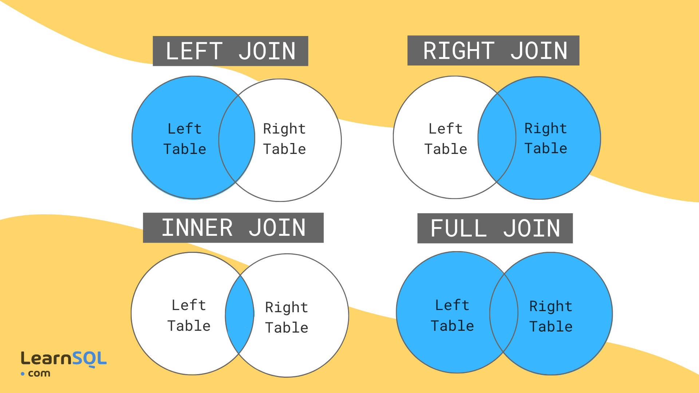

# Joins
- **Joins** are used to combine rows from two or more tables based on a related column between them.
- We'll discover how the FROM clause in a T-SQL SELECT statement creates intermediate virtual tables that will be consumed by later phases of the query.

> Because of that, First 2 tables joins and then the result of that join will be joined with the third table.

> Default join type in T-SQL is INNER JOIN.

> When Multiple matching columns are present in the tables, it's called **composite joins**.





## The From Clause And Virtual Tables
- This clause determines which table or tables will be the source of rows for the query. 
- The FROM can reference a single table or bring together multiple tables as the source of data for your query. 
- You can think of the FROM clause as creating and populating a virtual table.
- From will work but, where will to be interpreted by the query processor for make a decision about the best read strategy.
- The virtual table created by a FROM clause is a logical entity only. 
- In SQL Server, no physical table is created, whether persistent or temporary, to hold the results of the FROM clause, as it is passed to the WHERE clause or other parts of the query.


### SQL-89 Join Syntax
- In the ANSI SQL-89 standard, joins were specified by including multiple tables in the FROM clause in a comma-separated list. 
- Any filtering to determine which rows to include were performed in the WHERE clause, like this:

```sql
SELECT p.ProductID, m.Name AS Model, p.Name AS Product
FROM SalesLT.Product AS p, SalesLT.ProductModel AS m
WHERE p.ProductModelID = m.ProductModelID;
```

- This syntax is still supported by SQL Server, but because of the complexity of representing the filters for complex joins, it is not recommended. 
- Additionally, if a WHERE clause is accidentally omitted, ANSI SQL-89-style joins can easily become Cartesian products and return an excessive number of result rows, causing performance problems, and possibly incorrect results.

### SQL-92 Join Syntax
- With the advent of the ANSI SQL-92 standard, support for the keywords **JOIN** and **ON** clauses was added.

```sql
-- JOIN is specified as a CROSS JOIN
    SELECT p.ProductID, m.Name AS Model, p.Name AS Product
    FROM SalesLT.Product AS p
    JOIN SalesLT.ProductModel AS m ON p.ProductModelID = m.ProductModelID;
```


## Inner Join
- The **INNER JOIN** keyword selects records that have matching values in both tables.

> Note: The order in which tables are listed in the FROM clause for an INNER JOIN doesn't matter to the SQL Server optimizer.
> Conceptually, joins will be evaluated from left to right.

```sql
    SELECT emp.FirstName, ord.Amount
    FROM HR.Employee AS emp 
    JOIN Sales.SalesOrder AS ord -- INNER JOIN is the default join type
     ON emp.EmployeeID = ord.EmployeeID;
```

- The FROM clause specifies the **HR.Employee** table as one of the input tables, giving it the alias **emp**.
- The JOIN operator in line 3 reflects the use of an INNER JOIN (the default type in T-SQL) and specifies **Sales.SalesOrder** as the other input table, which has an alias of ord.
- SQL Server will perform a logical Cartesian join on these tables and pass the results as a virtual table to the next step. 
  - The physical processing of the query may not actually perform the Cartesian product operation, depending on the optimizer's decisions. 
  - But it can be helpful to imagine the Cartesian product being created.
- Using the ON clause, SQL Server will filter the virtual table, keeping only those rows where an EmployeeID value from the emp table matches a EmployeeID in the ord table.
- The remaining rows are left in the virtual table and handed off to the next step in the SELECT statement.


## Outer Joins (Left, Right, Full)
- **Outer Joins** are used to return rows from one or both tables that have no match in the other table.
- Outer joins are used when you want to return rows from one or both tables that have no match in the other table.
- Outer joins are specified using the **LEFT JOIN**, **RIGHT JOIN**, or **FULL JOIN** keywords.
- It's not necessary to use the **OUTER** keyword with the **LEFT**, **RIGHT**, or **FULL** keywords, but it can be used for clarity.

```tsql
    SELECT emp.FirstName, ord.Amount
    FROM HR.Employee AS emp
             LEFT OUTER JOIN Sales.SalesOrder AS ord
                             ON emp.EmployeeID = ord.EmployeeID;

    SELECT emp.FirstName, ord.Amount
    FROM HR.Employee AS emp
             LEFT JOIN Sales.SalesOrder AS ord
                       ON emp.EmployeeID = ord.EmployeeID;
```

- Unlike an INNER JOIN, the order in which tables are listed and joined in the FROM clause does matter with OUTER JOIN, as it will determine whether you choose LEFT or RIGHT for your join.


## Cross Join
- A **CROSS JOIN** returns the Cartesian product of the two tables.
- A cross join is simply a Cartesian product of the two tables. 
- Using ANSI SQL-89 syntax, you can create a cross join by just leaving off the filter that connects the two tables. 
- Using the ANSI-92 syntax, it’s a little harder; which is good, because in general, a cross join isn't something that you usually want. 
- With the ANSI-92 syntax, it's highly unlikely you'll end up with a cross join accidentally.

```tsql
-- ON clause can not use. If use it will be an error.
    SELECT emp.FirstName, ord.Amount
    FROM HR.Employee AS emp
             CROSS JOIN Sales.SalesOrder AS ord;
```


## Full Join
- A **FULL JOIN** returns rows when matching rows and non-matching rows are found in either table.
- Non-matching rows will come with NULL values.

```tsql
    SELECT emp.FirstName, ord.Amount
    FROM HR.Employee AS emp
             FULL JOIN Sales.SalesOrder AS ord
                       ON emp.EmployeeID = ord.EmployeeID;
```


## Self Join
- A **self join** is a regular join, but the table is joined with itself.

```tsql
    SELECT emp.FirstName AS Employee,
           mgr.FirstName AS Manager
    FROM HR.Employee AS emp
           LEFT OUTER JOIN HR.Employee AS mgr
                           ON emp.ManagerID = mgr.EmployeeID;
```